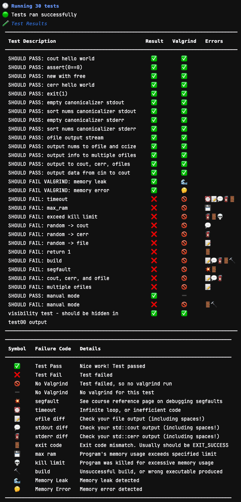

# Intro 
Although this repo is named 'gradescope-autograder', it is really two things:
1) A CI/CD pipeline that smoothly maintains the course and supports the autograder. 
2) An autograding framework [that seamlessly interoperates with Gradescope].

If you don't want to use the infrastructure framework, see the 'global' repo branch. Otherwise, email `mrussell at cs dot tufts dot edu` with a) your eecs utln [note you need to have logged in to gitlab.cs.tufts.edu at least once using `LDAP` with your Tufts eecs `utln` and password], b) which course you are working with (e.g. cs15), and c) what term the course will be for (e.g. spring, fall, etc.). He will create the template repo for you and add you as the `Owner`. This step will enable your repo to access group-level variables used by the CI/CD pipeline.

# Architecture Visualizations
This is all of the architecture used here. Aside from setting up the gitlab-runner instance, you will not manually interface with the architecture; your job will only be to push to the repo. 🥳
<div align="center">
    
</div>


## Gradescope Autograding Pipeline Visualization 
What happens when a student submits code to Gradscope. This pipeline is automated; you will only update assignment autograding code within the framework detailed [below](#autograding-framework).
<div align="center">
    
</div>


## CI/CD Pipeline Visualization
CI/CD pipeline that runs when you push code to the repo. The steps in orange are handled by Gitlab and the gitlab-runner. The steps in teal have been written by course-staff. 
<div align="center">
    
</div>

# Repository Structure
Once you have received the email from `mrussell`, clone your repo. The default expected repository structure is as follows. Note that some of these paths are configurable - see `config.toml` below for details.
```
.
├── assignments
│   ├── my_first_assign
│   │   ├── autograder
│   │   ├── files
│   │   ├── solution
│   │   └── spec
|   ...
|   |
│   └── my_nth_assign
│       ├── autograder
│       ├── files
│       ├── solution
│       └── spec
├── autograding
│   ├── bin
│   └── etc
├── bin
├── files
├── public_html
├── staff-bin
└── config.toml
```

## **files** and **public_html** directories
* `public_html/` contains symlinks to the `assignments/${assign_name}/spec/${assign_name}.pdf` spec files.
* `files/` contains symlinks to the `assignments/${assign_name}/files` starter code directories.

The script `staff-bin/make-symlinks` will create these symlinks for you.

## **bin**
Contains code executable by students 

## **staff-bin**
Contains code executable by staff

# **`config.toml`**
The `config.toml` file contains various essential bits of information related to the directory structure, and your course configuration in general. Please configure it as appropriate.

```toml
[repo]
AUTOGRADING_ROOT = "autograding" 
ASSIGN_ROOT      = "assignments" 
ASSIGN_AG_DIR    = "autograder"   # e.g. assignments/my_assign/autograder
ASSIGN_SOL_DIR   = "solution"     # e.g. assignments/my_assign/solution

[eecs]
COURSE_NUM = 15
TERM       = "2023s"     # CI/CD puts course files to /g/$COURSE_NUM/$TERM
FILE_GROUP = "ta15"      # CI/CD chgrps course files as $FILE_GROUP

[tokens]
MANAGE_TOKENS   = true   # manage tokens or not?
GRACE_TIME      = 15     # (in minutes)
TOKEN_TIME      = 1440   # (in minutes)
STARTING_TOKENS = 5      # max per-student: modifiable anytime
MAX_PER_ASSIGN  = 2      # (this must be 2 for now)
[tokens.EXCEPTIONS]      
"mrussell@cs.tufts.edu" = 1 # adjust student max: EXACT email on gradescope

[misc]
SUBMISSIONS_PER_ASSIGN = 5                      # overridable in testset.toml
TEST_USERS             = ["mrussell@cs.tufts.edu"] # EXACT gs email

[style]
NON_CODE_STYLE_CHECKSET = ['README', '.h', '.cpp']
CODE_STYLE_CHECKSET     = ['.h', '.cpp']
MAX_COLUMNS             = 80
COLUMNS_STYLE_WEIGHT    = 1    # XXX_STYLE_WEIGHT relative points to deduct
TABS_STYLE_WEIGHT       = 1
TODOS_STYLE_WEIGHT      = 0.5  # TODO comments in code
SYMBOL_STYLE_WEIGHT     = 0.5  # &&, ||, !, etc.
BREAK_STYLE_WEIGHT      = 0.5  # 'break'
BOOLEAN_STYLE_WEIGHT    = 0.5  # x == true, y == false
```

# Establish the CI/CD Runner
## Preliminaries
You will need a `gitlab-runner` in order for the CI/CD pipeline to run when you `git push`.  Fortunately, the EECS staff have setup the requisite infrastucture such that getting this ready is straightforward. Note that you may want to use a course-specific user account to set this runner up, since the CI/CD script will otherwise have access to your personal files. `staff@eecs.tufts.edu` are excellent about creating such accounts promptly; things to tell them: 1) the account will need to be in the group listed in `config.toml` [usually, `taCOURSENUM`, e.g. `ta15`], 2) this group will have to be available on the `podman-vm01` server. 

Now, open a shell, and run the following commands. 
```
ssh [or the course-specific utln]@linux.cs.tufts.edu
ssh vm-podman01
/usr/bin/python3 -m pip install toml-cli toml --user
gitlab-runner register
```
Here are the variables you'll need:
* GitLab instance URL: https://gitlab.cs.tufts.edu
* Registration Token: In the `gitlab.cs.tufts.edu` web interface, navigate to your course repo, click the settings cog (lower-left side of the screen), and then select CI/CD. Expand the `runners` section. Copy the token.
* Description, Tags, and Maintenance Note: [optional] whatever you'd like
* Executor: `shell`

## Update the runner's default directory
By default, the gitlab runner saves data in the home directory of the user (under `~/.gitlab-runner/builds`). If you are using the pipeline to auto-build docker containers for gradescope, this will not work out-of-the-box because the scripts used by the pipeline to make the builds rely on podman, and podman does not work by default on nfs mounted drives. Also, the builds directory can take up quite a bit of space in your home directory. The `/data/` directory on the eecs server is a good directory to use and will avoid both of these issues. This directory is deleted every 30 days, but the gitlab-runner reproduces the necessary folders on its own without issue. In order to update this, you can open the file: `~/.gitlab-runner/config.toml`, and, under `[[runners]]`, add (or update):

```
builds_dir = "/data/your_utln/builds/course"
cache_dir = "/data/your_utln/builds/cache"
```
If you ever want to see 'behind-the-scenes' of the gitlab-runner's working directory, etc. you can do so through the builds_dir here. 

## Configure podman
Recall that our gitlab-runner will be used to automatically build Docker containers for autograding. Given that we are on `RHEL`, which does not have native `Docker` support, we will use `podman` instead. There are two wrinkles with `podman` on our `RHEL` instance: you can't use `podman` on an nfs mount, and the permissions vis-a-vis `UID/GID` issues are tricky. Fortunately there are solutions to both of these problems. Copy the following text and put it in a file on the eecs server located at `~/.config/containers/storage.conf` [make the directories if needed]. Make sure to update your utln for the `graphroot` variable.
```toml
[storage]
driver = "overlay"
graphroot = "/var/tmp/YOUR_eecs_UTLN_HERE/containers/storage"

[storage.options.overlay]
ignore_chown_errors = "true"
```

The `graphroot` directory is where the podman (docker) containers for your course's autograding container will actually be stored - if you receive any odd podman-related errors, nuking this directory is a good first idea [it will be repopulated by podman automatically].

## Start the Runner
Lastly, run the command:
```bash
gitlab-runner run &
```
At this point the runner will start running. 

You can exit out of the terminal, and due to the system configuration this runner will stay alive. Now refresh the web page in the gitlab interface and expand the `runners` section again - you should see your runner available. **One thing to ensure - select the pencil icon next to the runner name, and make sure `Run untagged jobs` is checked. Good!** Now, Go back to the CI/CD settings, and expand the `variables` section. Add 2 variables here.

| Variable Key  |    <div style="width:295px">Example Value</div> | Purpose |
|----------|--------------------|------|
| `AUTOGRADING_ROOT` | `autograding` | Directory path in you repo where the autograding folder is - should be the same as the `AUTOGRADING_ROOT` variable in the `config.toml` file |
| `REPO_WRITE_DEPLOY_TOKEN` | ... | Deploy token for your repository. Create one in the gitlab web interface with settings->access tokens. The token must have `read_repository` and `write_repository` permissions, and must have at least the `maintainer` role |

# Notes on podman
* You can expect that the disk usage on your system will be directly proportional to the number of available processes you provide to your runner, as each separate process has its own clone of the repo. 
* `podman` containers **cannot** be mounted on nfs drives (e.g. your home directory); this is one of the reasons the `storage.conf` file is necessary above. 
* Despite that your containers will be built in `/var/tmp/YOUR_eecs_UTLN_HERE/containers/storage`, there is still a upper-limit to the storage space. I ran out at ~20gb. A few handy `podman` commands in regard to this
    * `podman system df`          -> shows your podman disk usage
    * `podman system prune --all` -> frees unused space from podman
                                  -> the output re: space freed can be misleading (look super large) if your containers share layers. 
    * `podman rmi --all --force`  -> cleans any containers that might be in-use (sometimes is an issue if containers-builds are quit mid-process)
 
    * The default behavior of our `CI/CD` scripts that use podman is to automatically run `podman system prune --all --force` and `podman rmi --all --force` to cleanup. This is not the most efficient in that the autograding containers will need to be pulled every time rather than leveraging a cache, but should keep your space on `/tmp` from filling up, which would prevent the script from running at all. TODO: update script to run the `prune/rmi` commands when `podman df` reports usage over ~10 (?) gb.
* If the EECS folks have to restart the `vm-podman01` server, for now you will have to manually restart your runner (`gitlab-runner run &`) [note that this has happened once the first year of the server being up].

# .gitlab-ci.yml
The 'magic' here all happens by way of the `.gitlab-ci.yml` file, which gitlab works with automatically whenever you run `git push`. The file is already configured to do what you'll need to (assuming your `config.toml` is set up properly). 

## **`course-repos`** group-level variables
To make this all work, the `.gitlab-ci.yml` file also relies on some gitlab environment variables that are set at a course-repos group level, and which are automatically accessible by every course under that group. **DO NOT MODIFY THESE GROUP-LEVEL VARIABLES! Furthemore, these variables contain sensitive information intended to be visible only to trusted members of the Tufts CS community, so please be careful to whom you give privileged access to your course repository!**

## Gitlab-runner jobs
The jobs which will run automatically (if required) on `git push` are

### 1. Updating course files and (file permissions!) on the eecs server
This is done with `rsync`. Remember that the runner runs *on the eecs servers*, so it can do all of this locally. Whichever account created the runner will own the files. They will be chmodded and chgrpd according to `config.toml`. The scripts `autograding/bin/restore-permissions` and `autograding/bin/reveal-current-assignments` will be run to rework the permissions of all the files in the repo, according to the release dates in the file `public_html/assignments.toml`.

Note: although the scripts to set permissions occur at every pipeline run, they will not by default run at the `correct' times to release student files. To fix this, at the start of the semester you can implement a pipeline schedule in gitlab so that the pipeline will run just after the release time you specify. The default pipeline will work fine, just change the time to your liking. See [here](https://docs.gitlab.com/ci/pipelines/schedules/#add-a-pipeline-schedule) for details.

### 2. Building a gradescope autograding docker container
Gradescope relies on docker containers to do the autograding for your course. One job that the runner will run is to build the container with a clone of your course repo inside of it; it will then upload that container to a private dockerhub repository at the location: **`tuftscs/gradescope-autograder:YOUR_COURSE_SLUG`**. This will happen automatically, so after it uploads, you simply need to enter this address in gradescope under the manual docker configuration for an autograding assignment. It will work immediately after the `CI/CD` job finishes. Note that the names in gradescope for your autograding assignments must match their names in the `assignments/` folder, with the exception that space characters on gradecsope are converted to underscores by the autograder. 

### 3. Building reference output for a given assignment
If you update the solution code or autograder code for a given assignment, the reference output for that assignment will be rebuilt. This works by the runner loading the solution code into a local copy of the autograding docker container, running the solution as the submission, and copying/pushing the resulting output files back to the repo. For relatively new assignments, often it is useful to debug. Yet, pushing these debugging files to/from the repo is a bit excessive. Therefore, these files will be automatically copied to `/g/COURSE_NUM/TERM/grading/${ASSIGN_NAME}/results/`. `/grading/` is a legacy folder name which is relatively arbitrary here - feel free to update it in the `.gitlab-ci.yml` file - the relevant portion is `GRADER_DEV_FOLDER: "grading"`; simply update `grading` to be that path from your `/g/COURSENUM/TERM/` folder on the server which TAs can access. This folder and subfolders/files will be chmodded 770. For details on the debug output for the autograder, see the framework below. Note! for changes to be discovered properly, you will likely want to set `git config pull.rebase true`; otherwise, if you have commited changes and need to pull before pushing, the uploaded merge won't correctly identify the changed files. 

If you'd like to read more of the details, see that file - it is explained in detail. Tweak it to your heart's content!


# Debugging CI/CD Issues
See below for a table of problems and solutions for debugging pipeline related issues. These account for almost all of the errors we generally see, but if the solutions here do not solve your problems, please reach out to me. 

| problem | discussion | solution | 
|---|---|---|
| Any `git` related errors regarding the repo (e.g. "cannot merge binary files", "branch __ not found", "unpack-objects failed" etc.) | Something has gone kerfluey with the gitlab-runner's cache. Reset it.  | In the gitlab web interface, go to `CI/CD->Pipelines` (`CI/CD` is the icon that looks like a shield), then press the `Clear runner caches` button on the top of the page. Then try re-running the job. |
| Any kind of `Docker` or `Podman` related issues ("Error: creating build container", Docker login problems, etc.) | The podman cache may need to be reset | `ssh` to `vm-podman01`, and `rm -rf /var/tmp/YOUR_UTLN/containers/storage/overlay`. If you see any errors, you may need to `chmod -R u+rwx` that folder prior to removing everything. Podman will automatically repopulate this directory, so no need to worry. After deleting the directory, try re-running the job. |
| "There has been a timeout failure or the job got stuck. Check your timeout limits or try again" | EECS server has been reset so we need to restart the runner. | login to `RUNNER_ACCT@vm-podman01` (see [here](#Preliminaries) for an example) and run the command `gitlab-runner run &`, then exit and via the web interface restart the job that failed. |

# Tokens
Tokens are handled completely behind-the-scenes by the container, which communicates with a `mysql` database hosted on the Tufts EECS servers during non-login sessions into the container [handled by `PAM`] (NOTE that this means that no token information is used when TA's ssh into the container; further,any token-related information is removed from the container during a login session via `PAM`). This communication occurs via a custom user account created by EECS IT staff. Variables which hold the account's information (username, private key) as well as the location of the tokens server and login information are held at `gitlab.cs.tufts.edu/course-repos`. Your course's slug (e.g. `gitlab.cs.tufts.edu/course-repos/cs15/{COURSE_SLUG}`) and the current semester (e.g. `2024s`) are used together as the database table automatically. In addition to automatic creation of the table, students and assignments are added automatically. The table holds the number of tokens currently used for a given student for each assignment. The information within the table is then used by the autograder (see `autograding/bin/token_manager.py` and `autograding/bin/validate_submission.py`) to validate a student's submission vis-a-vis tokens. You can change the way submissions are validated (e.g. max number of tokens per-student) via the `tokens` section of the `config.toml` file. You can do this for an individual student or for the entire roster. At this time the maximum number of supported tokens is 2, however the code could certaily be tweaked to allow for `N` tokens. If you *need* to manually access the database, you can do so by ssh'ing to the eecs servers under the account information specified above, and simply run `mysql --login-path=eecs_token_db`. Tread lightly as all token info is here for all courses! [...but don't worry too much as the EECS staff make daily backups].

## Conclusion
Continue to the next section to learn about the autograding framework, and for a walkthrough to setup an assignment. 

# Autograding Framework


## Introduction
The autograding framework is designed to have you writing and deploying tests as quickly as possible. 
There are three methods of testing a student's submission that this autograder supports

1) Tests which are a set of `.cpp` driver files, each with their own `main()`. 
2) Tests which send different input files to a student's executable program. 
3) Run your own code.

In any case above, `stdout`/`stderr` can be `diff`'d automatically against the output of a reference implementation, you can send a file to `stdin` for a test, output can be canonicalized before `diff`, and `valgrind` can be run on the programs as well. Limits can likewise be set for memory usage, timeout, etc. See details below.

## `autograde.py`
Before getting into the details, here is a summary of the procedure run by `bin/autograde.py`, which is the script that does the autograding. 
* Parse input arguments
* Load `testset.toml` file and validate configuration
* Create `Test` objects, each of which contains all possible configuration variables.
* Build directories required to run tests
* Compile the executable(s) specified in the configuration, and save compilation logs in `results/logs/testname.compile.log`
* Run each test: 
    * Save a dump of the initial Test object to `results/logs/testname.summary`
    * Execute the specified command
    * Run any `diff`s required based on the testing configuration; run canonicalization prior to `diff` if specified. 
    * Run `valgrind` if required.
    * Determine whether the test passed or not.
    * Save a dump of the completed Test object to `results/logs/testname.summary`
* Report the results to `stdout`.

## Files/Directories Created by the Autograder
The directories produced by the autograder are 
```
results
├── build/
├── logs/
├── output/
└── results.json

```
### build/
Inside the `build` directory are all of the students submitted files, and any course-staff-provided files which need to be copied over [see `copy` and `link` directories below]. Also there are the executables produced during the compilation step. 

### logs/
A set of compilation logs and summary files for each test. **Each `testname.summary` file in the `logs/` directory contains a dump of the state of a given test. This is literally a dump of the backend `Test` object from the `autograde.py` script, which contains all of the values of the various configuration options (e.g. `diff_stdout`, etc.) and results (e.g. `stdout_diff_passed`). A first summary is created upon initialization of the test, and it is overwritten after a test finishes with the updated results. `summary` files are very useful for debugging!**

### output/
Output of each test. Files in `output` are automatically generated for `stdout` and `stderr` streams, and are saved as `testxx.std{out/err}`. Likewise `{testname}.valgrind` files contain valgrind output. `.diff` files contain the result of `diff`ing the given output against the reference output are also here. If any of the output streams are to-be canonicalized prior to `diff`, then a `.ccized` file is created for that output stream [e.g. `testname.stdout.ccized`], along with the `.ccized.diff`, indicating that the files `diff`'d are the canoncialized outputs. Also here is a `.memtime` file, which contains the result of running `/usr/bin/time -v %M %S %U` on the given program. This file is only produced in the case where memory limits are set in the configuration. Lastly, `.ofile` files are produced for files written to by the program (see details below). Here's an example of possible outputs:
```
results
├── output
│   ├── test01.memtime
│   ├── test01.ofile
│   ├── test01.ofile.ccized
│   ├── test01.ofile.ccized.diff
│   ├── test01.stderr
│   ├── test01.stderr.diff
│   ├── test01.stdout
│   ├── test01.stdout.diff
│   ├── test01.valgrind
|   ...
│   ├── testn.memtime
│   ├── testnn.ofile
│   ├── testnn.ofile.ccized
│   ├── testnn.ofile.ccized.diff
│   ├── testnn.stderr
│   ├── testnn.stderr.diff
│   ├── testnn.stdout
│   └── testnn.stdout.diff
└
```
### `results.json`
`results.json` is the results file the gradescope parses to produce results in the web interface. 

## `testset.toml` configuration file
The framework depends on a `testset.toml` file (https://toml.io) to specify the testing configuration. `testset.toml` must be configured as follows
```toml
[common]
# common test options go here
# this section can be empty, but is mandatory
# this section must be named "common" 

[set_of_tests] 
# subsequent sections in the .toml file contain a group of tests to run
# configuration options placed under this section here will override the settings in [common] for these tests
# test group names (e.g. [set_of_tests]) can be anything
# tests in a section must be placed in a list named `tests'
tests = [
      { testname = "test0", description = "my first test" },
      { testname = "test1", description = "my second test" },   
      # ... 
      { testname = "testn", description = "my nth test" },
]
# each test **must** have testname and description fields
# you may add any other option to a given test
# test-specific options override any 'parent' options
```
See the section `test .toml configuration options` for the full details. 

## Example #1: Staff-Provided Driver Test Configuration [Default]
An assignment with course-staff provided `.cpp` driver files is the default behavior for the autograder. Using the `testset.toml` file above, for example, here is one possible configuration of a corresponding (bare-bones) directory structure 
```
.
|---testset/          
|   |---cpp/          [contains .cpp driver files]
|   |---makefile/     [contains custom Makefile]
|   |---ref_output/   [contains output of reference implementation]
|---testest.toml      [testing configuration file]
|-
```
For this simple grading configuration, the autograder assumes that each testname [e.g. `test01` above] corresponds to a file `testset/cpp/testname.cpp` which contains its own `main()`, and that there is a target named `testname` in `testset/makefile/Makefile` which produces an executable named `testname`; it will run `make testname`, and then `./testname`. Then, the default behavior will be to `diff` the output of the student's provided submission with the output in `ref_output`. Reference output can be generated automatically [see `Testing the Autograder` section below].


### testrunner.sh
Note the file `testrunner.sh`. This is an optional script must call `autograde`. Why would you need this, you ask? Great question. It's useful to have a unique script used by each autograding assignment which is separate from `run_autograder`. This is so that if you need to make any assignment-specific tweaks - prepping any unusual directories or files, or installing anything special programs, etc., you can simply make the relevant updates in this file and `git push`, without having to rebuild the whole autograding container. However, if you do not need to do anything other than run `autograde` (the default behavior), then the autograding program will work without this script. Some examples in this repo feature it, but you may remove it as needed. 

### Course-Staff-Provided Makefile
Here is an example of a corresponding `Makefile`, which would be in the directory `testset/makefile/`. Note that the `make` program will be run from the directory `results/build`. This example produces a target for each of `test01 ... test59`. Also, note that with this particular `Makefile`, the target to build (e.g. `make target`) must always be named the same as the program to run (e.g. `./target`).
```shell
# Testing Makefile
TESTSETDIR=../../testset
TESTSOURCEDIR=${TESTSETDIR}/cpp

CXX = clang++
CXXFLAGS = -Wall -Wextra -std=c++11 -I .

MYTESTS = $(shell bash -c "echo test{01..59}")

${MYTESTS}: StudentFile.o
	${CXX} ${CXXFLAGS} -o $@ $^ ${TESTSOURCEDIR}/$@.cpp

%.o: %.cpp $(shell echo *.h)
	${CXX} ${CXXFLAGS} -c $<

clean:
	rm -rf test?? *.o *.dSYM
```

## Example 2: Student Executable Test Configuration
Let's now assume that a student has written code to produce an executable program. A `testset.toml` file for such an assignment might look like this
```toml
[common]
our_makefile = false           # NOT DEFAULT -- use the student's Makefile to compile their program
executable   = "myprog"        # all of the tests will use this executable

[set_one]
tests = [
    { testname = "test01", description = "my first test" },
    { testname = "test02", description = "my second test" },
    { testname = "test03", description = "my third test" } 
]
```
And the corresponding (bare-bones) directory structure
```
.
|---testrunner.sh     [optional script that runs `autograde`]
|---testset/          [everything needed to run tests]
|   |---ref_output/   [output of reference implementation]
|   |---stdin/        [files to send as stdin to the tests]
|---testest.toml      [testing configuration file]
|-
```
Note that the default behavior of the autograder, regardless of testing format, is for any file in `testset/stdin/` that is named `<testname>.stdin` will be sent to `stdin` for a test with the testname `<testname>`. Also here we do not need a `makefile` folder - it is assumed we will be using the student's `Makefile` instead. 

## Command-Line Arguments
For any test, you may specify a variable `argv` which is a list of command-line arguments to send to the executable. This is doable with either style of assignment-testing demonstrated above. Note all `arvg` arguments must be written as strings, however they will be passed without quotes to the executable. To add `"` characters, escape them in the `argv` list. For example, the following test will be run as `./test0 1 2 "3"`.  
```toml
[my_test_group]
tests = [ 
    { testname = "test0", description = "my first test", argv = ["1", "2", "\"3\""] }
]
```
You may specify an `argv` value for a set of tests as well
```toml
# each test in tests[] below will have the argv list sent as its command-line arguments
[my_group_of_tests]
argv = ["hello", "world!"] 
tests = [
    { testname = "test01", description = "my first test" },
    { testname = "test02", description = "my second test" },
    { testname = "test03", description = "my third test" } 
]
# ...
```

## `diff`ing Output Files
In addition to `diff`ing student's `stdout` and `stderr` against a reference output, this framework supports `diff`ing against any number of output files created by the student's program. Specifically
1) Such output files must be named `<testname>.ANYTHING_HERE.ofile`
2) Such output files must be placed in `results/output/`

In order to make this happen
1) The expectation is that the executable will receive the name of the file to produce as a command-line argument to the program.
2) In the `testset.toml` file, you can use a special customizable string that will contain the correct output path,including the directory and beginning of the file name: `"${test_ofile_path}`". 

So, in practice, your test object might look like this
```toml
[set_of_tests]
tests = [   
    { testname = "test0", description = "my first test", argv = [ "${test_ofile_path}.one.ofile", "${test_ofile_path}.two.ofile" ] }
]
```
You can generalize this functionality to multiple tests as well. In the following example, all of the tests in the group [set_of_tests] will have these two argv arguments specified, whereby the string `"${test_ofile_path}"` will be replaced with the full path to the output file (e.g. `/autograder/results/output/test01`). 
```toml
[set_of_tests]
argv  = [ "${test_ofile_path}.cookies.ofile", "${test_ofile_path}.candy.ofile" ]
tests = [ 
    { testname = "test0", description = "my first test" },
    { testname = "test1", description = "my second test" }
    # ... 
]
```

## Canonicalization Prior to `diff`
The autograder supports canonicalization of either of `stderr`, `stdout`, or any output files generated by the program prior to `diff`ing against the reference. Functions which are used by the autograder in this capacity must be in a file `canonicalizers.py`, at the root of the assignment's autograder. Such functions must:
* Take five parameters (which will be provided by the autograder)
    1.  A byte string which will contain the student's output from whichever stream is to be canonicalized
    2.  A byte string which will contain the reference solution's (non-canonicalized) output from whichever stream is to be canonicalized
    3.  A string which will contain the name of the test (e.g. `test01`)
    4.  A string which will contain the name of the stream to be canonicalized [`stdout`, `stderr`, or the output filename in the `argv` list (e.g. `test0.one.ofile` or `test0.two.ofile` in the fist example above)]
    5.  A dictionary which will contain any specific configuration options for a test or set of tests (e.g. `{'my_config_var': 10}`)
* Return a string, which contains the canonicalized output of the student's program

Here's an example `testset.toml` file will which canonicalizes of all the possible output streams [ not sure why anyone would actually need to do this :) ]
```toml
[common]
ccize_stdout = true
ccize_stderr = true
ccize_ofiles = true            # canonicalize the output files before diff'ing
ccizer_name  = "sort_lines"    # use 'sort_lines' function in canonicalizers.py
ccizer_args  = { "random_variable": 10 }
our_makefile = false           # use the student's Makefile
executable   = "studProg"      # all of the tests will run this executable

[the_tests]
argv  = ["myDataFile", "${test_ofile_path}.one.ofile", "${test_ofile_path}.two.ofile"] 
tests = [
    { testname = "test01", description = "my first test" },
    ...
]
```
And here's a dummy example for `canonicalizers.py` which sorts in order if the stream is `stdout/stderr`, but in reverse order if the output is an ofile. 

```python
# canonicalizers.py
def sort_lines(student_unccd_output, reference_unccd_output, testname, streamname, params):
    student_unccd_output = student_unccd_output.decode('utf-8')
    if streamname in ['stdout', 'stderr']:
        student_ccd = sort(student_unccd_output) 
    else:
        student_ccd = sort(student_unccd_output, reverse=True)
    return student_ccd
```
Note that the output is decoded first. This is required if you want to work with standard text. The binary input here is to maintain flexibility in case your output is originally binary. 

## Copying / Linking Files and Folders to Build/
Often you will want to give the executable program access to certain folders and/or files provided by the course staff. 
* Any files or folders in an optional `testset/copy` directory will be copied to the `build` directory prior to running tests. 
* Similarly, any files in an optional `testset/link` directory will be symlinked-to from the `build` directory. Symlinking is convenient if you have a particularly large set of directories to work with.

## Test Time and Memory Limits
Options exist to limit time and memory usage of student programs. See the test configuration options section below for details. 

## All Possible Files and Directories for an Assignment's Autograder
As expressed above with the simple examples, you will likely not need all of these for a given assignment. Items marked with a * are mandatory in all cases. 
```
.
|---canonicalizers.py [file with canonicalization function(s)]
|---testrunner.sh     [script that runs `autograde`; only necessary if you need to do anything special, otherwise `autograde` will be run without it]
|---submission/       *[student submission (provided by gradescope, so doesn't need to be in the repo)]
|---testset/          *[everything needed to run tests]
|   |---copy/         [files here will be copied to results/build/]
|   |---cpp/          [.cpp driver files]
|   |---link/         [files here will be symlinked in results/build/]
|   |---makefile/     [contains custom Makefile]
|   |---ref_output/   *[output of reference implementation]
|   |---solution/     [solution code - this location is the default, but can be anywhere]
|   |---stdin/        [files here are sent to stdin]
|---testest.toml      *[testing configuration file]
|-
```

## All`testset.toml` Test Configuration Options
These are the configuration options for a test. You may set any of these in `[common]`, under a test group, or within a specific test.

| option | default | pupose | 
|---|---|---|
| `max_time` | `10` | maximum time (in seconds) for a test [a test foo is run as `timeout max_time ./foo`]|
| `max_ram` | `-1` (unlimited) | maximum ram (in MB) usage for a test to be considered successful [`/usr/bin/time -f %M` value is compared with max_ram * 1024] |
| `valgrind` | `true` | run an additional test with valgrind [valgrind tests ignore `max_ram`] |
| `diff_stdout` | `true` | test diff of student vs. reference stdout |
| `diff_stderr` | `true` | test diff of student vs. reference stderr |
| `diff_ofiles` | `true` | test diff of student vs. reference output files |
| `ccize_stdout` | `false` | diff canonicalized stdout instead of stdout |
| `ccize_stderr` | `false` | diff canonicalized stderr instead of stderr |
| `ccize_ofiles` | `false` | diff canonicalized ofiles instead of ofiles |
| `ccizer_name` | `""` | name of canonicalization function to use |
| `ccizer_args` | `{}` | arguments to pass to canonicalization function |
| `our_makefile` | `true` | use `testset/makefile/Makefile` to build tests |
| `exitcodepass` | `0` | return code considered successful by the autograder|
| `pretty_diff` | `true` | use `icdiff` for easy-to-read diffs |
| `max_score` | `1` | maximum points (on Gradescope) for this test |
| `visibility` | `"after_due_date"` | Gradescope visibility setting |
| `argv` | `[ ]` | argv input to the program - Note: all arguments in the list must be represented as strings (e.g. ["1", "abcd"...])|
| `executable` | `<testname>` | Name of the executable to build [`make ___` is run] and run [`./____` is run]|
| `exec_command` | `""` | Enables 'manual mode' for a given test. In this mode, specify the specific command to-be-run [e.g. `python3 my_file.py`]. Automatic management of `stdin/stdout/stderr/ofiles` will work as usual; also `kill_limit`, `max_ram`, and `timeout` limits work as normal. Canonicalization will likewise work. Make sure to set `valgrind` to `false` if you don't want it to run for these tests. If `exec_command` is used, the `executable` argument will be ignored. `executable` above will be ignored, and  `make` will not be run by default; only the command you provide will be run. | 
| `required_files` | `[]` | `[common]` only setting - List of required files for a given assignment. Submissions provided to the autograder without any files will quit early and show a message to the students with the files they are missing. Such submissions will **not** count against them if there is a `max_submission` limit set in the `config.toml` file. |
| `max_valgrind_score` | `8` | `[common]` only setting - maximum valgrind score for this assignment [per-test valgrind score is deduced by default based on this value]. 
| `valgrind_score_visibility` | `"after_due_date"` | `[common]` only setting - visibility of the test which will hold the total valgrind points for the student. | 
| `kill_limit` | `750` | `[common]` only setting - test will be killed if it's memory usage exceeds this value (in `MB`) - soft and hard rlimit_data will be set to this value in a preexec function to the subprocess call. NOTE: this parameter is specifically intended to keep the container from crashing, and thus is `[common]` only. Also, if the program exceeds the limit, it will likely receive `SIGSEGV` or `SIGABRT` from the os. Unfortunately, nothing is produced on `stderr` in this case, so while the test will likely fail based on exitcode, it's difficult to 'know' to report an exceeded memory error. However, if `valgrind` is also run and fails to produce a log file (due to also receiving `SIGSEGV`/`SIGABRT`), the test will be assumed to have exceeded max ram...in general, however, this is tricky to debug. In my experience, `valgrind` will fail to allocate memory but still produce a log file at `~50MB` of ram; any lower and no log file will be produced. The default setting of `750` `MB` should be fine for most tests, and will work with the smallest (default) container. |
| `max_submissions` | _ | `[common]` only setting - this value will override the default value of `SUBMISSIONS_PER_ASSIGN` in the `etc/config.toml`. If not set for an assignment, the default value for this is ignored, and the `SUBMISSIONS_PER_ASSIGN` value is used instead. |
| `max_submission_exceptions` | {} | `[common]` only setting - dictionary of the form `{ "Student Gradescope Name" = num_max_submissions`, ...}`. Note that `toml` requires the dict to be one-line. Alternatively, you can specify `[common.max_submission_exceptions]`, with the relevant key-valud pairs underneath.  |
| `required_files` | [] | `[common]` only setting - List of files required for an assignment. Autograder will quit prior to running if any files are missing, and the submission will not be used in the count for the `max_submission` value for the student | 
| `style_check` | `false` | `[common]` only setting - Automatically perform style checking. See and update `bin/style_check.py` for details on this. | 
| `manage_tokens` | `config.toml 'MANAGE_TOKENS' value` | `[common]` only setting - whether or not to manage tokens for this specific assignment. Defaults to managing them if specified as such in the coursewide `config.toml` file, but this is a convenient per-assignment override. |
 

## Gradescope Results
After running the autograder, our program produces results for Gradescope. A few notes on this:

### Visibility settings
Gradescope allows each test to have a different visiblity setting - the options are `hidden`, `after_due_date`, `after_published`, or `visible`. Their systems are setup such that if any of the options are `hidden`, all of the tests will be hidden. The default setting is therefore `after_due_date`, which is usable with tests that are also `visible`. We often like to show some tests but not others, and this generally works well. 

We also decided that we would like to show students their total final autograder score prior to the due date; that is, they could see their 'final score', but only a few of the actual tests. This is not doable by default. In order to facilitate this, added a `test00` in `bin/make_gradescope_results.py` which shows the student's final autograder score. This code is commented out by default, but if you would like to show students their final autograder score without revealing all of the test results then uncomment `#make_test00()` in the `make_results()` function (line ~250) of `bin/make_gradescope_results.py`.

## Score in Gradescope
Note that if the `max_score` for a test is `0`, then Gradescope assumes that the student passes the test. There's no way around this on our end, so if you want to have 'optional' tests, then just lower the maximum score of the autograder on Gradescope (on gradescope.com - `assignment->settings->AUTOGRADER POINTS`).

# Conclusion
That should be enough to get you up and running! Please feel free to contact me with any questions you have, and/or any bugs, feature requests, etc. you find. Thanks!

# Changelog
[1.0.1] - Sync updates from 15 2024s
[1.0.0] - Port over from old `gradescope-autograding` setup.
